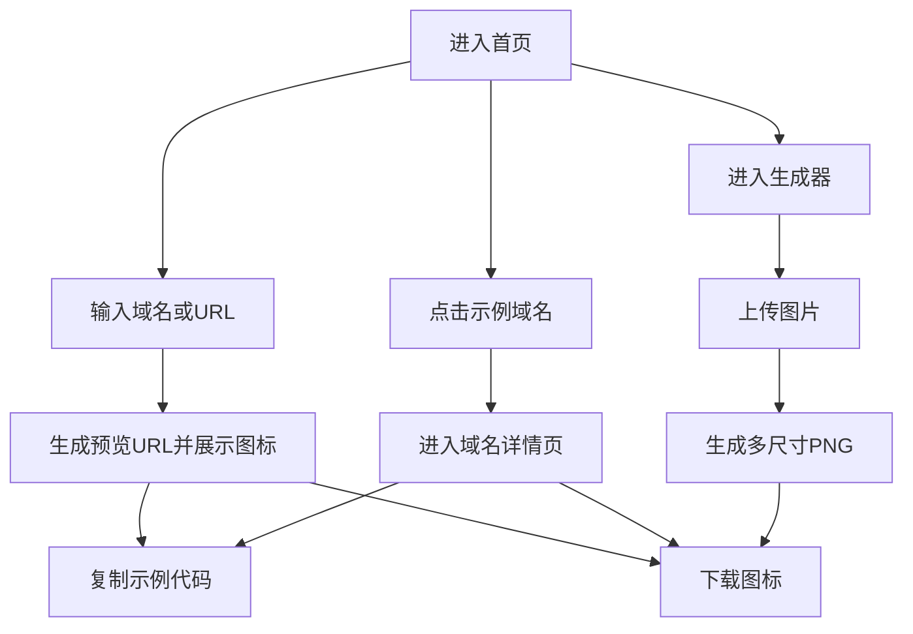

## 1. 产品概述
复刻「Favicon.im/{domain}」的中文落地页与核心交互：输入域名即时预览并下载网站图标。
- 面向开发者/设计师：快速获取任意站点 favicon 并复制可直接嵌入的图片 URL
- 目标价值：提供一个可自部署的前端演示站，保持与原站相同的信息架构与交互体验

## 2. 核心功能

### 2.1 用户角色
无角色区分，所有访问者可直接使用。

### 2.2 功能模块
1. **首页**：标题与说明、示例网站图标墙、图标 API 使用区（输入/预览/复制/下载）、博客列表、产品推荐、FAQ、页脚导航
2. **域名详情页**：展示指定域名的 favicon（默认/大尺寸）、可复制示例代码、下载入口
3. **图标生成器页（简化）**：上传图片并生成多尺寸 PNG（16/32/48/64/128/256），提供下载（不追求 100% 等同原站的 ICO 产物）

### 2.3 页面详情
| 页面名称 | 模块名称 | 功能描述 |
|---|---|---|
| 首页 | 顶部导航 | 展示站点名、语言入口（仅保留 ZH UI）、跳转到生成器 |
| 首页 | Hero 区 | 显示「Favicon.im/{domain}」标题与一句说明、展示关键指标（如 “30M+” 可作为静态展示） |
| 首页 | 示例图标墙 | 网格展示热门域名及对应 favicon，点击进入域名详情页 |
| 首页 | 图标 API 使用 | 输入框（域名/URL）、两种尺寸（默认/大），每个尺寸包含：示例代码块、复制按钮、图标预览、下载按钮 |
| 首页 | 额外参数说明 | 展示 default-avatar / throw-error-on-404 的说明（静态） |
| 首页 | 博客列表 | 展示文章标题列表（静态），可点击（跳转到外部或占位） |
| 首页 | 产品推荐 | 展示若干产品卡片（静态） |
| 首页 | FAQ | 折叠面板（Accordion），默认收起，点击展开答案 |
| 首页 | 页脚 | 工具/转换器/域名工具/友情链接/语言列表等（静态） |
| 域名详情页 | 图标展示 | 根据路由参数 domain 生成预览 URL，展示默认/大尺寸图标与下载 |
| 域名详情页 | 代码片段 | 提供可复制 img 标签示例 |
| 生成器页 | 上传与预览 | 上传图片，展示预览、输出多尺寸 PNG、逐个下载或一键下载（逐个即可） |

## 3. 核心流程
用户主要流程：
1) 用户进入首页 → 在输入框输入域名/URL → 立即看到预览图标与示例代码 → 点击复制或下载  
2) 用户点击示例域名卡片 → 进入域名详情页 → 复制/下载  
3) 用户进入生成器 → 上传图片 → 生成多尺寸 PNG → 下载

## 4. 用户界面设计

### 4.1 设计风格
- 视觉方向：极简开发者工具风，强调可读性与高对比度
- 主色：深色中性背景（接近 charcoal / zinc），强调色使用亮蓝/青作为按钮与链接
- 字体：标题使用更具识别度的 Display 字体，正文使用易读的 Sans（最终以实现时可用字体为准）
- 按钮：圆角胶囊（pill）与轻微阴影/描边，Hover 有亮度变化
- 布局：单列内容流 + 分区标题，核心模块使用卡片容器与网格

### 4.2 页面设计概览
| 页面名称 | 模块名称 | UI 元素 |
|---|---|---|
| 首页 | Hero 区 | 大标题、简短说明、数据指标、滚动引导（可选） |
| 首页 | 示例图标墙 | 响应式网格、图标圆角底板、域名标签、Hover 提示可点击 |
| 首页 | 图标 API 使用 | 输入框、两列尺寸卡片、代码块（等宽字体）、复制按钮、预览区、下载按钮 |
| 首页 | FAQ | Accordion，展开时带过渡动画与内容排版 |
| 域名详情页 | 图标展示 | 域名标题、默认/大尺寸两卡片布局、下载与复制动作 |
| 生成器页 | 上传与预览 | 拖拽/点击上传、输出列表（尺寸与下载按钮） |

### 4.3 响应式
桌面优先；移动端改为单列堆叠，图标墙与卡片自适应列数，触控区域不小于 44px。

