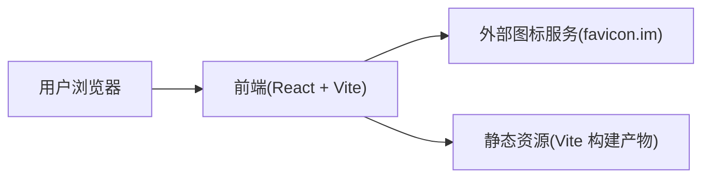

## 1. 架构设计

说明：
- 本复刻项目聚焦前端体验与交互复现，不实现 favicon 抓取与解析的后端逻辑
- 图标预览与下载通过拼接 `https://favicon.im/{domain}` 与查询参数实现

## 2. 技术选型说明
- 前端：React@18 + TypeScript + react-router-dom + tailwindcss@3 + zustand
- 初始化工具：vite-init（react-ts 模板）
- 后端：无（如需自建 favicon 抓取服务，可在后续版本引入 Express 并实现服务端抓取/缓存）
- 数据：静态数据（示例域名、博客列表、产品列表、FAQ 文案）

## 3. 路由定义
| 路由 | 用途 |
|---|---|
| / | 首页（落地页 + 图标 API 使用区） |
| /domain/:domain | 域名详情页（默认/大尺寸预览、复制、下载） |
| /generator | 图标生成器页（上传图片生成多尺寸 PNG） |

## 4. API 定义
无自建 API。

## 5. 数据模型
无数据库；页面内容以本地常量维护。

