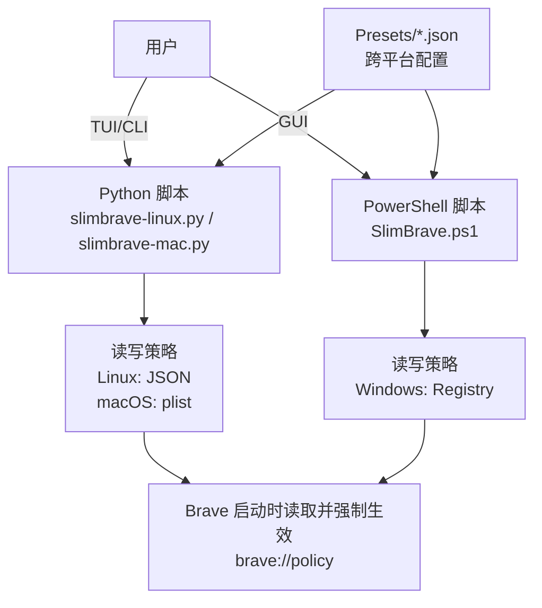

# 01. 项目概览

## 项目定位

SlimBrave Neo 是一个跨平台脚本工具，用于通过 Chromium/Brave 的“企业托管策略（托管策略 / 企业策略）”对 Brave Browser 进行去臃肿与加固（关闭遥测、关闭不需要的功能、强化隐私选项等）。

核心特点：

- 无构建系统、无第三方依赖
- Linux/macOS 使用 Python 3 标准库（TUI + CLI）
- Windows 使用 PowerShell + WinForms（图形界面）
- 配置可导入/导出，三平台共享同一 JSON 格式（预置 Presets 与导出 Export）

参考：

- 项目总体说明与运行方式：[README.md](file:///workspace/README.md)
- 官方分发与安全声明：[SECURITY.md](file:///workspace/SECURITY.md)

## 整体架构（高层）

该仓库更像“脚本产品”而非典型应用工程：没有包管理清单（如 package.json/pyproject.toml），核心由三个入口脚本与一组预置（Presets）JSON 组成。

## 主要模块与职责

- Python（Linux/macOS）
  - **策略读写**：将“勾选的功能”转换为 Chromium 托管策略，并以原子方式写入到系统策略路径
  - **导入/导出**：兼容 Windows 导出（含 UTF-16 BOM），并支持新旧两种 `Features` 表达格式
  - **交互界面**
    - Linux/macOS：curses TUI（可编辑 DoH 模板 URL）
    - Linux/macOS：CLI（用于脚本化批量应用/导出/重置）
  - **安装检测**：提示用户 Brave 是否存在、安装方式（flatpak/snap 等）与潜在限制

- PowerShell（Windows）
  - **策略写入**：向 `HKLM/HKCU:\SOFTWARE\Policies\BraveSoftware\Brave` 写入键值
  - **图形界面**：WinForms 勾选项 + DNS 下拉框与模板输入
  - **导入/导出**：保存/读取与 Python 相同的 JSON 配置结构
  - **初始化回显**：启动时读取注册表并回填勾选状态

## 依赖关系（概览）

- 运行依赖
  - Linux/macOS：Python 3（标准库：argparse、curses、json、os、subprocess、tempfile 等；macOS 额外 plistlib）
  - Windows：PowerShell（使用 .NET WinForms/Drawing）
- “外部系统依赖”
  - Brave Browser 会在启动时读取托管策略；因此脚本本身不需要改动 Brave 安装文件
